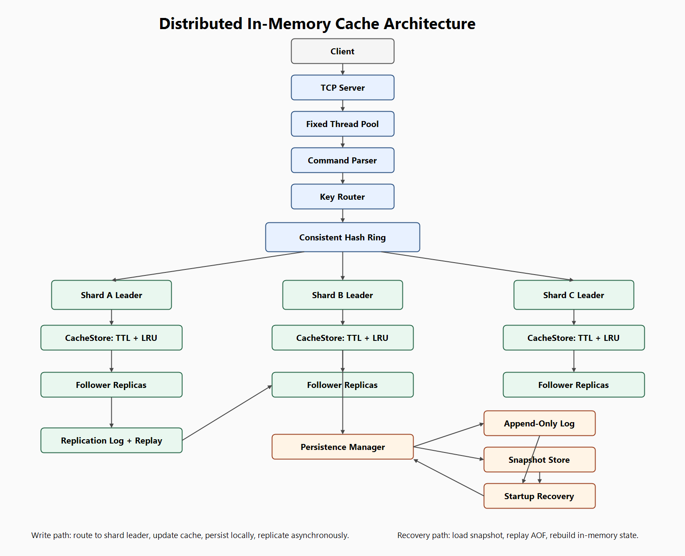
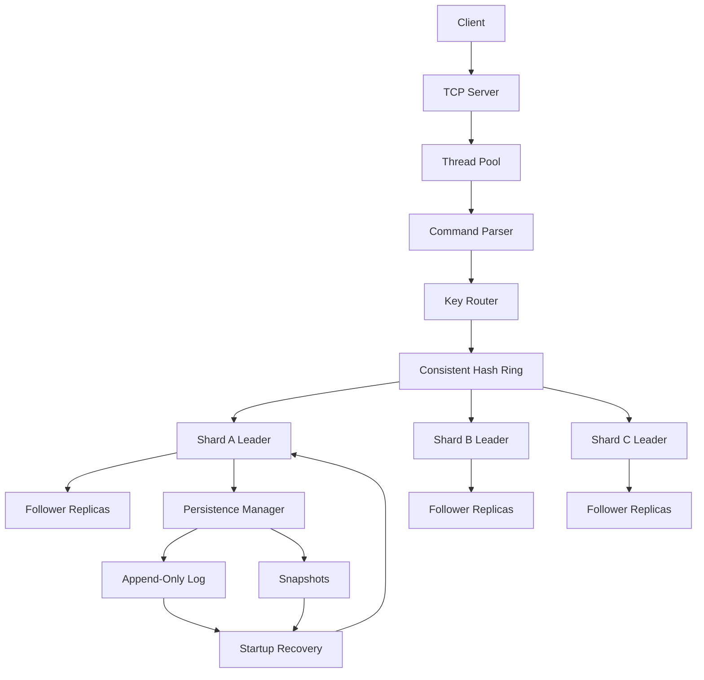

# Distributed In-Memory Cache

C++17 Distributed Systems Project featuring replication, sharding, persistence, and concurrent TCP networking.

This repository is a production-inspired distributed cache built from first principles in modern C++17. It is intentionally scoped as an educational infrastructure project: the code demonstrates the core mechanics behind cache engines, TCP servers, replication, consistent hashing, and durable recovery without pretending to be a production database.

## Overview

The project evolved through five focused phases:

| Phase | Focus | What It Added |
| --- | --- | --- |
| Phase 1 | Single-node cache | Thread-safe in-memory key/value cache, TTL expiration, LRU eviction |
| Phase 2 | Networking | Concurrent TCP server, protocol parsing, fixed thread pool |
| Phase 3 | Replication | Leader/follower replication, async propagation, replication log, replay recovery |
| Phase 4 | Sharding | Consistent hashing, virtual nodes, shard ownership, rebalancing |
| Phase 5 | Persistence | Append-only persistence log, snapshots, startup recovery, crash reconstruction |

The result is a compact distributed systems project that covers the fundamentals interviewers tend to care about:

- How requests move through a concurrent server.
- How cache entries expire and evict.
- How followers catch up after missed replication.
- How consistent hashing minimizes key movement.
- How append-only logs and snapshots rebuild state after a restart.

## Architecture Overview

At a high level, clients talk to a TCP server. The server uses a fixed thread pool to process client sessions. Requests are parsed into cache commands, routed to the owning shard when sharding is enabled, applied to the local cache, replicated from shard leaders to followers, and persisted locally through an append-only log plus snapshots.



### Request Lifecycle

```text
Client
  -> TCP Server
  -> Thread Pool
  -> CommandParser
  -> KeyRouter
  -> ConsistentHashRing
  -> Shard Leader CacheStore
  -> ReplicationManager
  -> PersistenceManager
```

### Write Path

Writes are accepted by leaders only.

```text
PUT key value
  -> parse command
  -> find owning shard
  -> update leader CacheStore
  -> append persistence AOF record
  -> append replication log entry
  -> asynchronously send to followers
```

Followers reject client writes and accept replicated writes only through the replication protocol.

### Read Path

Reads are routed by key ownership.

```text
GET key
  -> parse command
  -> find owning shard
  -> read CacheStore
  -> lazily remove expired entry if needed
```

The current router reads from the owning shard node. The architecture leaves room for follower read routing later.

### Recovery Path

```text
startup
  -> load latest snapshot
  -> replay AOF entries after snapshot sequence
  -> rebuild in-memory CacheStore
  -> restore TTL metadata with elapsed-time aging
```

Expired TTL entries are not resurrected during recovery.

## Feature List

- TCP networking with a simple text protocol
- Fixed thread pool for concurrent client handling
- Thread-safe in-memory cache API
- LRU eviction using `std::list`
- TTL expiration with lazy cleanup
- Configurable cache capacity
- Leader/follower replication
- Read-only followers
- Append-only replication logs
- Replica replay recovery with `SYNC_FROM`
- Consistent hashing ring
- Virtual nodes per shard
- Shard-aware request routing
- Dynamic shard addition/removal
- Best-effort shard rebalancing
- Append-only persistence log
- Snapshot persistence
- Startup and crash recovery
- Persistence durability policies
- Benchmarks for cache, replication, sharding, and persistence
- Tests for all major subsystems

## Distributed Systems Concepts

### Eventual Consistency

Replication is asynchronous. A leader can acknowledge a write before every follower has applied it. This means followers may briefly serve stale reads. That tradeoff keeps writes fast and the architecture understandable.

### Asynchronous Replication

Leaders append a replication log entry and submit follower sends to a replication thread pool. Followers apply `REPL_PUT` and `REPL_DELETE` messages locally. If a follower reconnects, it can request missed entries with `SYNC_FROM <sequence>`.

### Consistent Hashing

Keys and shard virtual nodes are hashed into the same `uint64_t` ring. A key is owned by the first shard clockwise from the key hash. This avoids the massive remapping problem caused by `hash(key) % N`.

### Horizontal Scalability

Adding shards expands capacity by moving only the key ranges newly owned by the added shard. Removing a shard moves that shard's keys to their new clockwise owners.

### Partition Ownership

The shard manager knows which node owns each key. The router checks ownership before writes, reads, and deletes. Writes require a shard leader.

### Durability

Persistence is node-local. Mutations are appended to an AOF file, and snapshots periodically checkpoint full cache state. Recovery loads the snapshot first, then replays later log entries.

### Replay Reconstruction

Both replication and persistence use replay-oriented design. Replication replay catches followers up after disconnects; persistence replay rebuilds a node after restart.

## Architecture Diagram

Mermaid source is available in [docs/architecture.mmd](docs/architecture.mmd).



## Performance

Benchmark details and local smoke-test results are documented in [docs/performance.md](docs/performance.md).

These numbers are not presented as production claims. They are local development measurements used to validate behavior and compare subsystem costs.

| Benchmark | Workload | Local Result |
| --- | --- | --- |
| Cache | 50k mixed PUT/GET, capacity 10k | ~1.05M ops/sec, p50 0.60 us, p99 1.90 us |
| Replication | 5k replicated writes, 2 loopback followers | ~101k writes/sec, p50 2.50 us, p99 65.80 us |
| Sharding | 10k writes, 4 shards, 64 vnodes | ~365k writes/sec, p50 1.80 us, p99 6.20 us |
| Persistence | 5k persisted writes, AOF + snapshot recovery | ~8.8k writes/sec, p50 87.70 us, p99 309.60 us |

## Design Tradeoffs

The major tradeoffs are documented in [docs/design_tradeoffs.md](docs/design_tradeoffs.md).

Key choices:

- Thread pools instead of thread-per-connection.
- Leader/follower replication instead of multi-leader writes.
- Asynchronous replication instead of quorum writes.
- Consistent hashing instead of modulo hashing.
- Virtual nodes for smoother key distribution.
- Snapshots plus AOF instead of log-only recovery.
- No consensus yet, by design.

## Interview Notes

For interview preparation, see [docs/interview_notes.md](docs/interview_notes.md). It covers likely questions about networking, replication, sharding, consistent hashing, persistence, recovery, concurrency, and future improvements.

## Build Instructions

### CMake

```sh
cmake -S . -B build
cmake --build build
ctest --test-dir build --output-on-failure
```

### Direct g++ Build

On the current Windows/MSYS2-style environment, the project has been verified with direct `g++` builds. A representative build command:

```sh
g++ -std=c++17 -Wall -Wextra -Wpedantic -Iinclude \
  src/cache/cachestore.cpp src/cache/lruevictionpolicy.cpp src/cache/ttlmanager.cpp \
  src/net/client_session.cpp src/net/commandparser.cpp src/net/replication_server.cpp \
  src/net/replication_session.cpp src/net/tcpserver.cpp \
  src/persistence/append_only_log.cpp src/persistence/log_entry.cpp \
  src/persistence/persistence_manager.cpp src/persistence/recovery_manager.cpp \
  src/persistence/snapshot_manager.cpp \
  src/replication/replication_log.cpp src/replication/replication_manager.cpp \
  src/replication/replication_message.cpp src/replication/replication_peer.cpp \
  src/sharding/consistent_hash_ring.cpp src/sharding/key_router.cpp \
  src/sharding/rebalance_manager.cpp src/sharding/shard_manager.cpp \
  src/utils/threadpool.cpp src/main.cpp \
  -lws2_32 -o distributed_cache_app
```

On Linux/macOS, omit `-lws2_32`.

## Running Nodes

Leader:

```sh
./distributed_cache_app --leader --host 127.0.0.1 --port 6379 \
  --replication-port 7379 --peer 127.0.0.1:7380 \
  --data-dir data/leader --fsync every-second --snapshot-interval 30
```

Follower:

```sh
./distributed_cache_app --follower 127.0.0.1:7379 --host 127.0.0.1 \
  --port 6380 --replication-port 7380 \
  --data-dir data/follower --fsync every-second
```

Volatile test node:

```sh
./distributed_cache_app --leader --port 6379 --no-persistence
```

## Example Usage

The TCP protocol is newline-delimited text.

```text
PUT alpha one
OK
GET alpha
VALUE one
DELETE alpha
DELETED
GET alpha
NOT_FOUND
```

Follower write rejection:

```text
PUT alpha one
ERROR follower is read-only
```

Replication behavior:

```text
Leader receives:   PUT user:42 profile-json
Leader appends:    REPL_PUT <seq> user:42 profile-json <timestamp>
Follower applies:  user:42 = profile-json
```

Shard routing example:

```text
PUT user:123 data
  -> hash(user:123)
  -> ConsistentHashRing owner lookup
  -> ShardB leader
  -> ShardB followers
```

## Testing

The repository includes focused executable test suites:

| Test Suite | Coverage |
| --- | --- |
| `cache_tests` | Put/get/delete, overwrite, TTL, LRU, capacity, concurrency |
| `network_tests` | Command parsing and thread pool behavior |
| `replication_tests` | Leader propagation, delete propagation, follower read-only behavior, replay recovery, ordering, multiple followers |
| `sharding_tests` | Consistent hash lookup, vnode distribution, minimal movement, removal rebalance, ownership, shard leader routing |
| `persistence_tests` | AOF logging, snapshots, startup recovery, replay reconstruction, crash simulation, TTL recovery, durability modes |

Direct execution examples:

```sh
./cache_tests
./network_tests
./replication_tests
./sharding_tests
./persistence_tests
```

## Benchmarks

Benchmark executables:

```sh
./cache_benchmark [cache_size] [operation_count]
./replication_benchmark [operation_count] [follower_count] [capacity]
./sharding_benchmark [operation_count] [shard_count] [virtual_nodes]
./persistence_benchmark [operation_count] [capacity]
```

See [docs/performance.md](docs/performance.md) for methodology, sample results, bottlenecks, and future profiling opportunities.

## Future Work

Possible future phases:

- Consensus-backed leader election.
- Advanced failover.
- Read routing to followers.
- Cross-shard operations with explicit transaction semantics.
- Bounded AOF compaction.
- Snapshot shipping.
- Compression for snapshots and logs.
- Async IO.
- Observability and metrics dashboards.
- Backpressure and overload control.

These were intentionally excluded so the current project stays focused on core distributed systems fundamentals: concurrency, replication, partitioning, durability, and recovery.

## Project Philosophy

This is not a production database. It is a production-inspired systems project designed to be read, explained, benchmarked, and extended. The code favors explicit architecture and clear tradeoffs over hidden magic.
